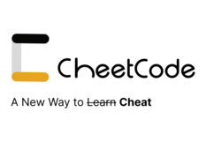

# CheetCode

    

## Inspiration

Algorithm interviews... suck. They're more a test of sanity (and your willingness to "grind") than a true performance indicator. That being said, large language models (LLMs) like Cohere and ChatGPT are rather _good_ at doing LeetCode, so why not make them do the hard work...?

Introduce: CheetCode. Our hack takes the problem you're currently screensharing, feeds it to an LLM target of your choosing, and gets the solution. But obviously, we can't just _paste_ in the generated code. Instead, we wrote a non-malicious (we promise!) keylogger to override your key presses with the next character of the LLM's given solution. Mash your keyboard and solve hards with ease.

The interview doesn't end there though. An email notification will appear on your computer after with the subject "Urgent... call asap." Who is it? It's not mom! It's CheetCode, with a detailed explanation including both the time and space complexity of your code. Ask your interviewer to 'take this quick' and then breeze through the follow-ups.

## How we built it

The hack is the combination of three major components: a Chrome extension, Node (actually... Bun) service, and Python script.

- The **extension** scrapes LeetCode for the question and function header, and forwards the context to the Node (Bun) service
- Then, the **Node service** prompts an LLM (e.g., Cohere, gpt-3.5-turbo, gpt-4) and then forwards the response to a keylogger written in Python
- Finally, the **Python keylogger** enables the user to toggle cheats on (or off...), and replaces the user's input with the LLM output, seamlessly

(Why the complex stack? Well... the extension makes it easy to interface with the DOM, the LLM prompting is best written in TypeScript to leverage the [TypeChat](https://microsoft.github.io/TypeChat) library from Microsoft, and Python had the best tooling for creating a fast keylogger.)

(P.S. hey Cohere... I added support for your LLM to Microsoft's project [here](https://github.com/michaelfromyeg/typechat). Gimme job plz.)

## Challenges we ran into

- HTML `Collection` data types are not fun to work with
- There were no actively maintained cross-platform keyloggers for Node, so we needed another service
- LLM prompting is surprisingly hard... they were not as smart as we were hoping (especially in creating 'reliable' and consistent outputs)

## Accomplishments that we're proud of

- We can now solve any LeetCode hard in 10 seconds
- What else could you possibly want in life?!
